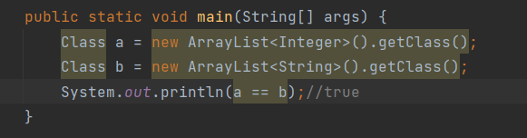

# 泛型
## 类型擦除一
Java的泛型是伪泛型，这是因为Java在编译期间，所有的泛型信息都会被擦掉。
Java的泛型基本上都是在编译器这个层次上实现的，在生成的字节码中是不包含泛型中的类型信息的，使用泛型的时候加上类型参数，在编译器编译的时候会去掉，这个过程成为类型擦除。
如在代码中定义List和List等类型，在编译后都会变成List，JVM看到的只是List，而由泛型附加的类型信息对JVM是看不到的。
泛型不能用于显性地引用运行时类型的操作之中，例如转型，instanceof和new操作（包括new一个对象，new一个数组），因为所有关于参数的类型信息都在运行时丢失了，所以任何在运行时需要获取类型信息的操作都无法进行工作。

## 类型擦除二

我们首先单独编译项目：`Build -> Build Project`
然后点击查看`GenericList`的字节码：`View -> Show Bytecode`
类型擦除即，当我们泛型参数时，`JVM`会对具体的类型进行擦除，取决于以下几个情况：

- 单一的泛型参数：类型替换成`Object`
- 单一的类型约束：类型替换成约束类型
- 有多个类型约束：替换成最左边的约束类型

泛型参数只是在编译期间用于对类型进行检测。

