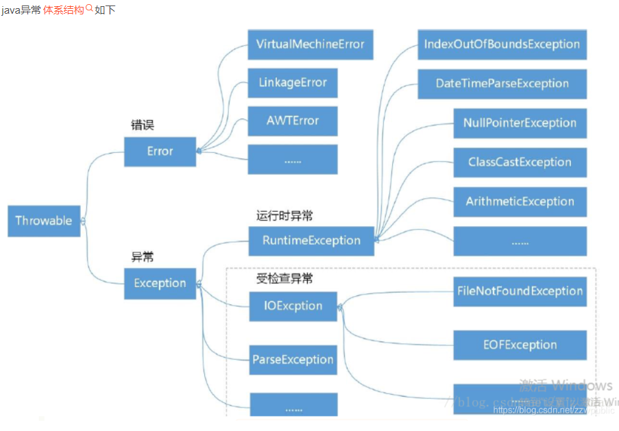

# java异常

## 关于异常的一些事

继承Exception类的异常都是受检测的异常，需要抛出，并且一定要进行捕捉

继承RunException类的异常都是运行时异常，不一定需要捕捉

堆栈跟踪是方法调用过程的轨迹，它包含了程序执行过程中方法调用的顺序和所在源代码行号。

堆栈跟踪信息从下往上，是方法调用的顺序。

Throwable类的两个直接子类：

Error:是程序无法修复的严重问题，程序员无法修复，这能让程序终止，比如jvm内部错误、存溢出和资源耗尽等严重情况。

Exception：是程序可以恢复的程序，是程序员可以从掌控的，比如，除零异常，空指针访问，网络连接终端，读取不存在等。

在Exception下面又有两个异常：

    非受检异常指的是java.lang.RuntimeException和java.lang.Error类及其子类，所有其他的异常类都称为受检异常。两种类型的异常在作用上并没有差别，唯一的差别就在于使用受检异常时的合法性要在编译时刻由编译器来检查。正因为如此，受检异常在使用的时候需要比非受检异常更多的代码来避免编译错误。

1 受检查异常：指除RuntimeException以外的异常类。共同特点是，编译器会检查这类异常是否进行了处理，要么捕获，要么不抛出，否则会发生编译错误，种类很多。

2 非受检查异常（运行时异常）：运行时异常是继承RuntimeException类的直接子类或者间接子类，运行时异常往往是程序员所犯的错误导致的 。特点是编译器不检查这类异常是否得到了处理，对于这类异常不捕获也不抛出，程序也可以编译过，一旦遇到就导致程序终止。

    对于运行时异常通常不采用抛出或捕获处理方式，而是应该提前预判，防止这种发生异常，做到未雨绸缪。例如除零时候，在进行除法运算之前应该判断除数是非零的，修改示例代码如下，从代码可见提前预判这样处理要比通过try-catch捕获异常要友好的多
————————————————
版权声明：本文为CSDN博主「zzwpublic」的原创文章，遵循CC 4.0 BY-SA版权协议，转载请附上原文出处链接及本声明。
原文链接：https://blog.csdn.net/zzwpublic/article/details/113792054