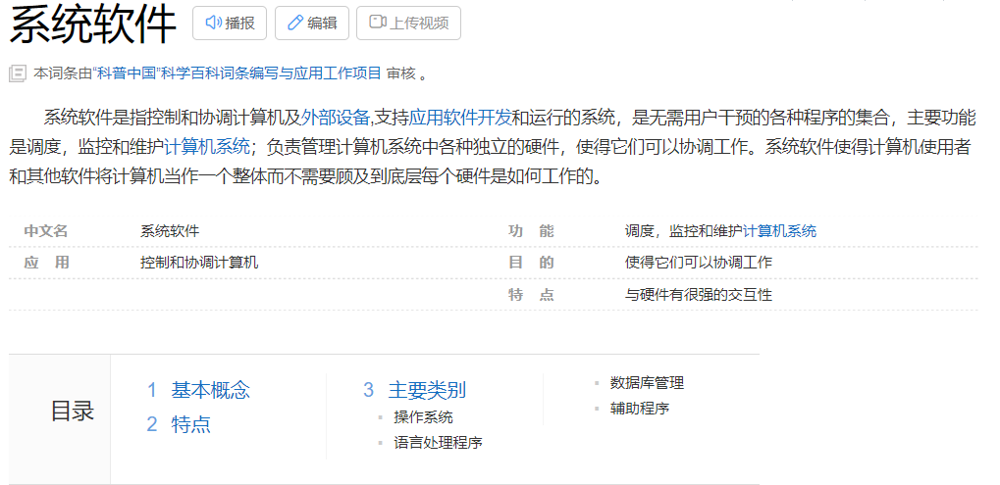

# 计算机概述

计算机（computer）俗称电脑，是现代一种用于高速计算的电子计算机器，可以进行数值计算，又可以进行逻辑计算，还具有存储记忆功能。是能够按照程序运行，自动、高速处理海量数据的现代化智能电子设备。

由硬件系统和软件系统所组成，没有安装任何软件的计算机称为裸机。可分为[超级计算机](https://baike.baidu.com/item/%E8%B6%85%E7%BA%A7%E8%AE%A1%E7%AE%97%E6%9C%BA/5373711)、工业控制计算机、[网络计算机](https://baike.baidu.com/item/%E7%BD%91%E7%BB%9C%E8%AE%A1%E7%AE%97%E6%9C%BA/101471)、[个人计算机](https://baike.baidu.com/item/%E4%B8%AA%E4%BA%BA%E8%AE%A1%E7%AE%97%E6%9C%BA/3731770)、[嵌入式计算机](https://baike.baidu.com/item/%E5%B5%8C%E5%85%A5%E5%BC%8F%E8%AE%A1%E7%AE%97%E6%9C%BA/693492)五类，较先进的计算机有[生物计算机](https://baike.baidu.com/item/%E7%94%9F%E7%89%A9%E8%AE%A1%E7%AE%97%E6%9C%BA/363245)、[光子计算机](https://baike.baidu.com/item/%E5%85%89%E5%AD%90%E8%AE%A1%E7%AE%97%E6%9C%BA/1880523)、[量子计算机](https://baike.baidu.com/item/%E9%87%8F%E5%AD%90%E8%AE%A1%E7%AE%97%E6%9C%BA/363335)等。

## 计算机的硬件系统

计算机硬件是计算机的重要组成部分，其中包含了5个重要的组成部分：运算器、控制器、存储器、输入设备、输出设备。

1、[运算器](https://baike.baidu.com/item/%E8%BF%90%E7%AE%97%E5%99%A8/2667320)。

计算机硬件中的运算器主要功能是对数据和信息进行运算和加工。运算器包括以下几个部分：[通用寄存器](https://baike.baidu.com/item/%E9%80%9A%E7%94%A8%E5%AF%84%E5%AD%98%E5%99%A8/283978)、[状态寄存器](https://baike.baidu.com/item/%E7%8A%B6%E6%80%81%E5%AF%84%E5%AD%98%E5%99%A8/2477799)、累加器和关键的[算术逻辑单元](https://baike.baidu.com/item/%E7%AE%97%E6%9C%AF%E9%80%BB%E8%BE%91%E5%8D%95%E5%85%83/8954657)。运算器可以进行算术计算（加减乘除）和逻辑运算（与或非）。

2、[控制器](https://baike.baidu.com/item/%E6%8E%A7%E5%88%B6%E5%99%A8/2206126)。

控制器和运算器共同组成了[中央处理器](https://baike.baidu.com/item/%E4%B8%AD%E5%A4%AE%E5%A4%84%E7%90%86%E5%99%A8/284033)（CPU）。控制器可以看作计算机的大脑和指挥中心，它通过整合分析相关的数据和信息，可以让计算机的各个组成部分有序地完成指令。

3、[存储器](https://baike.baidu.com/item/%E5%AD%98%E5%82%A8%E5%99%A8/1583185)。

顾名思义，存储器就是计算机的记忆系统，是计算机系统中的记事本。而和记事本不同的是，存储器不仅可以保存信息，还能接受计算机系统内不同的信息并对保存的信息进行读取。存储器由主存和辅存组成，主存就是通常所说的内存，分为RAM和ROM两个部分。辅存即外存，但是计算机在处理外存的信息时，必须首先经过内外存之间的信息交换才能够进行。

4、输入设备。

输入设备和输出设备都是进行人机互动的关键设备。鼠标、键盘等输入设备的出现，给计算机带来了天翻地覆的变化。现有的鼠标主要有两类：光电鼠标和机械式鼠标。通过鼠标，我们可以很方便地在计算机屏幕上进行坐标的定位，可以很好地操作图形和软件处理，为人类提供了最大的便捷。键盘也是一类非常重要的输入设备，计算机大部分的指令都是通过键盘输入来进行的。

5、输出设备。

输出设备也是计算机人机互动的关键设备，它的特点是可以将计算机的信息以画面的形式展现出来，具有很好的直观性。常见的输出设备有显示器、打印机、语音和视频输出装置等

## 计算机的软件系统

计算机的软件系统是指**计算机在运行的各种程序、数据及相关的文档资料**。**计算机软件系统通常被分为系统软件和应用软件两大类**。**计算机系统软件能保证计算机按照用户的意愿正常运行，为满足用户使用计算机的各种需求，帮助用户管理计算机和维护资源、执行用户命令、控制系统调度等任务**。软件系统分为两大类，虽然各自的用途不同，但他们的共同点是都存储在[计算机存储器](https://baike.baidu.com/item/%E8%AE%A1%E7%AE%97%E6%9C%BA%E5%AD%98%E5%82%A8%E5%99%A8/786229)中，以某种格式编码书写的程序或数据。 

### 系统软件

# 计算机语言

计算机语言（Computer Language）指用于人与计算机之间通讯的语言。计算机语言是人与计算机之间传递信息的媒介。计算机系统最大特征是指令通过一种语言传达给机器。为了使电子计算机进行各种工作，就需要有一套用以编写计算机程序的数字、字符和语法规划，由这些[字符](https://baike.baidu.com/item/%E5%AD%97%E7%AC%A6/4768913)和[语法规则](https://baike.baidu.com/item/%E8%AF%AD%E6%B3%95%E8%A7%84%E5%88%99/1095093)组成计算机各种指令（或各种语句）。这些就是计算机能接受的语言。 

计算机语言的种类非常的多，总的来说可以分成机器语言，[汇编语言](https://baike.baidu.com/item/%E6%B1%87%E7%BC%96%E8%AF%AD%E8%A8%80)，高级语言三大类。 

